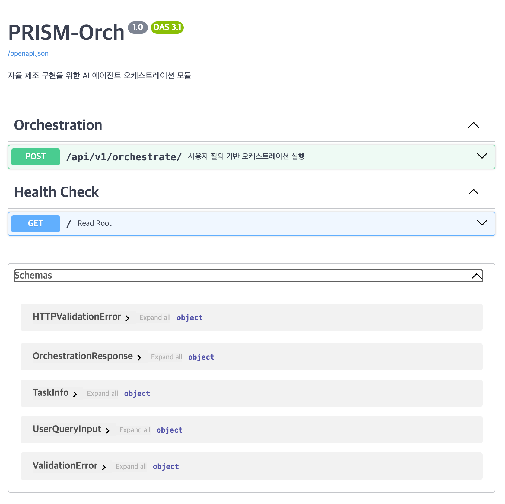

# PRISM-Orch: AI 에이전트 오케스트레이션

`PRISM-Orch`는 [PRISM-AGI](../README.md) 플랫폼의 핵심 구성 요소로, 여러 AI 에이전트들의 작업을 조율하고 관리하는 오케스트레이션 에이전트입니다.

## 1. 주요 기능

### 멀티 에이전트 관리 시스템
- 에이전트의 등록, 상태 조회 및 관리를 위한 레지스트리
- 비동기 작업 처리를 위한 작업 큐 및 스케줄링 시스템
- 에이전트 간 통신 프로토콜 정의 및 표준화
- 작업 분배 및 우선순위 관리를 위한 알고리즘

### 검색 증강 생성 (RAG) 시스템
- **prism-core Vector DB 통합**: 외부 지식베이스 접근을 위한 벡터 DB 구축 및 관리
- **에이전트 메모리 관리**: 에이전트의 작업 기억을 위한 메모리 DB 설계
- **외부 LLM 기반 작업 분해**: 사용자 지시를 명확하게 재구성하고 체계적인 작업 계획 수립
- **동적 계획 조정**: 에이전트 결과를 바탕으로 작업 계획을 실시간으로 수정 및 개선

### 제약 조건 관리
- 제조 공정의 물리적, 운영적 제약 조건 위반 탐지 시스템
- 리워드 모델을 통한 에이전트 행동의 예상 보정 에러율 관리
- 작업자의 선호도 및 공정 제약 조건을 반영하는 알고리즘

### 자연어 인터페이스
- 대형 언어 모델(LLM)을 활용한 사용자 질의 이해 및 처리
- 사용자 의도를 파악하고 실행 가능한 작업으로 변환하는 모듈
- 에이전트가 더 잘 이해할 수 있도록 지시를 수정하고 명료화하는 기능

## 2. 성능 목표

| 기능 | 지표 | 목표 |
| --- | --- | --- |
| **RAG 시스템** | 재작성 인스트럭션 검색 개선율 | 70% |
| | 검색 증강 생성 정합성 | 10% 향상 |
| **제약 조건 관리** | 제약 상황 위반 탐지 정확도 | 90% |
| | 예상 보정 에러율 (ECE) | 0.0078 |

## 3. 실행 방법

### 1. 의존성 설치

프로젝트에 필요한 라이브러리를 설치합니다.

```bash
pip install -r requirements.txt
```

### 2. 환경 변수 설정

`.env.example` 파일을 복사하여 `.env` 파일을 생성하고, 필요한 환경 변수(예: `OPENAI_API_KEY`)를 설정합니다.

```bash
cp .env.example .env
# nano .env 또는 다른 편집기를 사용하여 .env 파일 수정
```

### 3. 서버 실행

FastAPI 웹 서버를 실행합니다.

```bash
python -m src.main
```

서버가 정상적으로 실행되면, 터미널에서 `Application startup...` 와 같은 메시지를 확인할 수 있습니다.
API 문서는 서버 실행 후 `http://127.0.0.1:8000/docs` 에서 확인할 수 있습니다.

### 4. RAG 기반 Task Planning 테스트

RAG 시스템과 Task Planner의 기능을 테스트합니다.

```bash
python test_rag_planning.py
```

이 테스트는 다음 기능들을 검증합니다:
- prism-core Vector DB를 통한 지식 검색
- 외부 LLM을 활용한 작업 분해 및 계획 수립
- 에이전트 메모리 검색 및 관리
- 통합 워크플로우 테스트

### 5. 테스트 클라이언트 실행

**새로운 터미널**을 열고, 아래 명령어를 실행하여 API가 정상적으로 동작하는지 테스트합니다.

```bash
python test_client.py
```

클라이언트는 실행 중인 서버에 샘플 요청을 보내고, 받은 응답을 터미널에 출력합니다.

